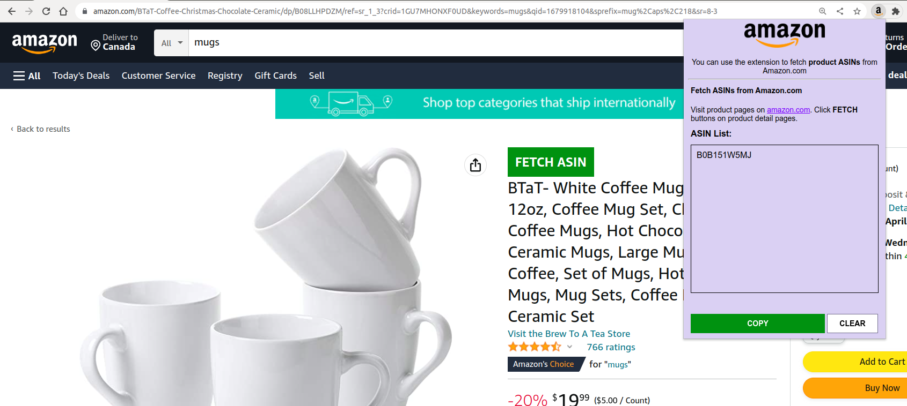
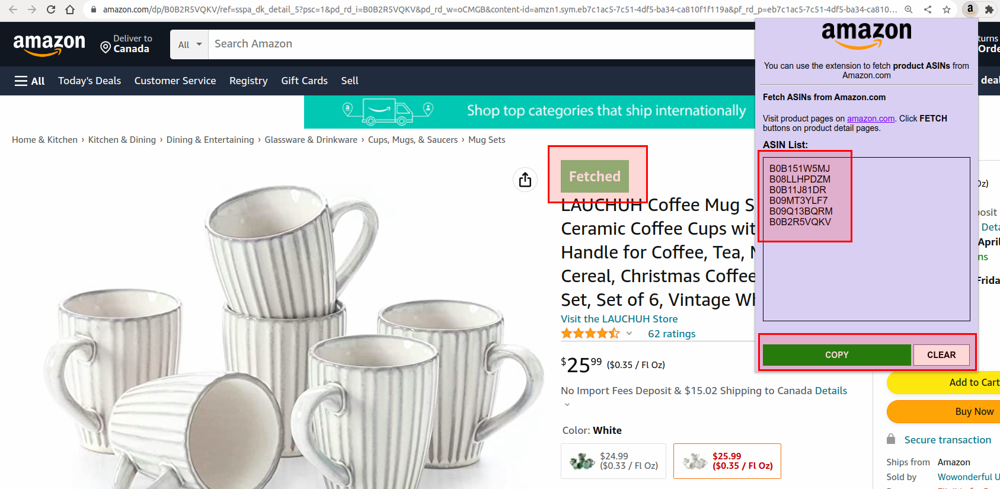

# Chrome-Extension-Amazon-Product-Fetcher
Amazon Product ASIN Fetcher - Chrome Extension

### HOW TO RUN:
- Download **Chrome-Extension-Amazon-Product-Fetcher** folder from here
- Go to **chrome://extensions/** page on your **Google Chrome Browser**
- Click **Load unpacked** and select the downloaded folder
- All fetched ASINs will be listed on extension
- Copy all fetched ASINs with **COPY** button

### DESCRIPTIONS:
- **ASIN:** Amazon Standard Identification Number (Product ID)
- Fetch product ASINs from **amazon.com**
- Visit product pages on https://www.amazon.com/ and Click **FETCH** buttons on product detail pages.

### SCREENSHOTS:
<kbd></kbd>
  
<kbd></kbd>
